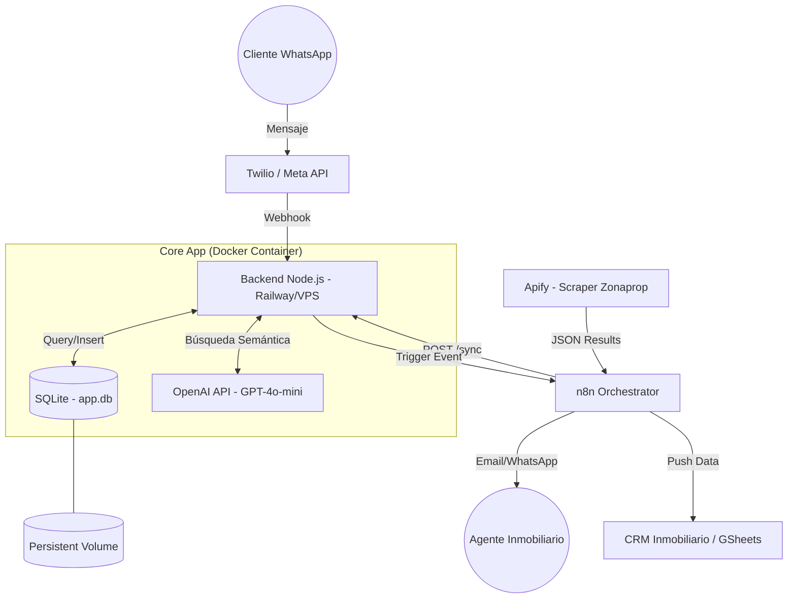

# Inmo24x7 MVP

Asistente virtual de inmobiliaria con integración de OpenAI y SQLite.

## Características

- Chatbot con OpenAI para calificar leads
- Búsqueda de propiedades según operación, zona y presupuesto
- Persistencia de leads en SQLite
- Handoff a asesor humano
- Sesiones en memoria por userId

## Arquitectura del Sistema



## Dataset

Este proyecto utiliza el dataset de propiedades de Zonaprop Argentina proporcionado por [Luminati.io](https://github.com/luminati-io/Zonaprop-Argentina-dataset-samples).

- **Fuente:** https://github.com/luminati-io/Zonaprop-Argentina-dataset-samples
- **Ubicación:** `src/data/zonaprop-argentina-dataset.csv`
- **Propiedades:** ~955 propiedades reales de Argentina
- **Zonas disponibles:** Capital Federal, GBA Norte/Sur/Oeste, Buenos Aires Costa Atlántica, Córdoba, Mendoza, Santa Fe, y más

## Requisitos

- Node.js 18+
- SQLite (incluido via better-sqlite3)

## Setup

```bash
cp .env.example .env
# Editar .env con tu OPENAI_API_KEY
npm install
npm run db:init
npm run dev
```

## Comandos disponibles

### Bot (chat)

| Comando | Descripción |
|---------|-------------|
| `/reset` | Reinicia la conversación actual y limpia la sesión del usuario |

## Endpoints API

### Health Check

```http
GET /health
```

**Response:**
```json
{
  "ok": true,
  "service": "inmo24x7-mvp"
}
```

### Mensajes (Chat)

```http
POST /message
Content-Type: application/json

{
  "userId": "usuario-123",
  "text": "Hola, busco un departamento"
}
```

**Response:**
```json
{
  "messages": ["Hola! ¿Buscás comprar o alquilar?"],
  "handoff": {
    "summary": "Lead interesado en alquiler en Palermo"
  }
}
```

### Leads (Gestión de leads)

#### Listar todos los leads

```http
GET /api/leads
```

**Response:**
```json
{
  "leads": [
    {
      "id": 1,
      "createdAt": "2025-02-09T10:00:00.000Z",
      "userId": "usuario-123",
      "operacion": "alquiler",
      "zona": "Palermo",
      "presupuestoMax": 1500,
      "nombre": null,
      "contacto": null,
      "summary": "Lead calificado por bot"
    }
  ]
}
```

#### Obtener lead por ID

```http
GET /api/leads/:id
```

**Response:**
```json
{
  "lead": {
    "id": 1,
    "createdAt": "2025-02-09T10:00:00.000Z",
    "userId": "usuario-123",
    "operacion": "alquiler",
    "zona": "Palermo",
    "presupuestoMax": 1500,
    "nombre": null,
    "contacto": null,
    "summary": "Lead calificado por bot"
  }
}
```

**Errors:**
- `400` - Invalid lead ID
- `404` - Lead not found

#### Eliminar lead

```http
DELETE /api/leads/:id
```

**Response:**
```json
{
  "success": true
}
```

**Errors:**
- `400` - Invalid lead ID
- `500` - Failed to delete lead

### Panel de Administración (Web)

#### Ver todos los leads (Interfaz web)

```http
GET /admin/leads
```

Muestra una interfaz HTML con tabla de todos los leads capturados. Incluye:
- Listado de leads con ID, fecha, operación, zona, presupuesto, nombre, contacto y resumen
- Enlaces para ver detalle de cada lead
- Botón para refrescar la lista

#### Ver detalle de un lead (Interfaz web)

```http
GET /admin/leads/:id
```

Muestra página HTML con información detallada del lead específico.

### Archivos estáticos

```http
GET /
```

Sirve la interfaz web de chat desde `src/public/index.html`

## Scripts npm

| Script | Descripción |
|--------|-------------|
| `npm run dev` | Inicia el servidor en modo desarrollo con hot reload |
| `npm run build` | Compila TypeScript a JavaScript |
| `npm start` | Ejecuta el servidor compilado |
| `npm run db:init` | Inicializa la base de datos SQLite |

## Variables de entorno

```env
OPENAI_API_KEY=tu_api_key_aqui
OPENAI_MODEL=gpt-4.1-mini  # opcional, default: gpt-4.1-mini
PORT=3000                  # opcional, default: 3000
```

## Estructura del proyecto

```
src/
├── index.ts              # Entry point
├── db.ts                 # Configuración SQLite
├── services/
│   ├── botService.ts     # Lógica del chatbot
│   ├── leadService.ts    # Gestión de leads
│   ├── sessionService.ts # Gestión de sesiones
│   ├── toolHandler.ts    # Manejadores de herramientas OpenAI
│   ├── toolParser.ts     # Parseo de tool calls
│   ├── propertyService.ts # Búsqueda de propiedades
│   ├── openaiClient.ts   # Cliente OpenAI
│   └── sessionStore.ts   # Almacenamiento en memoria
├── repositories/
│   └── leadRepo.ts       # Acceso a datos de leads
├── routes/
│   ├── message.ts        # Rutas de mensajes
│   └── leads.ts          # Rutas de leads
├── types/
│   └── types.ts          # Tipos TypeScript
└── public/
    └── index.html        # Interfaz web
```

## Base de datos

La aplicación usa SQLite con la tabla `leads`:

| Campo | Tipo | Descripción |
|-------|------|-------------|
| id | INTEGER | ID autoincremental |
| createdAt | DATETIME | Fecha de creación |
| userId | TEXT | Identificador del usuario |
| operacion | TEXT | venta o alquiler |
| zona | TEXT | Zona de interés |
| presupuestoMax | REAL | Presupuesto máximo |
| nombre | TEXT | Nombre del lead |
| contacto | TEXT | Info de contacto |
| summary | TEXT | Resumen de la conversación |

La base de datos se guarda en `data/app.db`.
