# Inmo24x7 MVP

Asistente virtual de inmobiliaria con integración de OpenAI y SQLite.

## Características

- Chatbot con OpenAI para calificar leads
- Búsqueda de propiedades según operación, zona y presupuesto
- Persistencia de leads en SQLite
- Handoff a asesor humano
- Sesiones en memoria por userId
- Webhook de WhatsApp (verificación GET + eventos POST)

## Arquitectura del Sistema

```mermaid
graph TD
    %% Usuarios y Entrada
    User((Cliente WhatsApp)) -->|Mensaje| Twilio[Twilio / Meta API]
    Twilio -->|Webhook| NodeServer[Backend Node.js - Railway/VPS]

    %% Procesamiento Core
    subgraph "Core App (Docker Container)"
        NodeServer <-->|Query/Insert| SQLite[(SQLite - app.db)]
        NodeServer <-->|Búsqueda Semántica| OpenAI[OpenAI API - GPT-4o-mini]
    end

    %% Capa de Datos (Scraping)
    Apify[Apify - Scraper Zonaprop] -->|JSON Results| N8N[n8n Orchestrator]
    N8N -->|POST /sync| NodeServer

    %% Automatizaciones y Notificaciones
    NodeServer -->|Trigger Event| N8N
    N8N -->|Email/WhatsApp| Agent((Agente Inmobiliario))
    N8N -->|Push Data| CRM[CRM Inmobiliario / GSheets]

    %% Capa de Persistencia (Volumen)
    SQLite --- Vol[(Persistent Volume)]
```



## Dataset

Este proyecto utiliza el dataset de propiedades de Zonaprop Argentina proporcionado por [Luminati.io](https://github.com/luminati-io/Zonaprop-Argentina-dataset-samples).

- **Fuente:** https://github.com/luminati-io/Zonaprop-Argentina-dataset-samples
- **Ubicación:** `src/data/zonaprop-argentina-dataset.csv`
- **Propiedades:** ~955 propiedades reales de Argentina
- **Zonas disponibles:** Capital Federal, GBA Norte/Sur/Oeste, Buenos Aires Costa Atlántica, Córdoba, Mendoza, Santa Fe, y más

## Fuentes de Datos de Propiedades

El sistema soporta múltiples fuentes de datos configurables mediante la variable de entorno `PROPERTY_LOADER`:

| Fuente | Valor | Descripción |
|--------|-------|-------------|
| CSV | `csv` (default) | Carga desde archivo CSV local (`src/data/zonaprop-argentina-dataset.csv`) |
| JSON | `json` | Carga desde archivo JSON local (`src/data/properties.json`) |
| Supabase | `supabase` | Carga desde base de datos Supabase en tiempo real |

### Configuración de Supabase

Para usar Supabase como fuente de datos:

1. Establece las variables en `.env`:
```env
PROPERTY_LOADER=supabase
SUPABASE_URL=https://tu-proyecto.supabase.co
SUPABASE_SERVICE_ROLE_KEY=tu-service-role-key
```

2. Asegúrate de tener las tablas `zp_postings` y `zp_posting_pictures` en Supabase

3. La tabla `zp_postings` debe contener las columnas: id, url, title, operation_type, price_amount, price_currency, location_name, city_name, state_acronym, latitude, longitude, status, publisher_name, whatsapp, main_features, general_features

## Requisitos

- Node.js 18+
- SQLite (incluido via better-sqlite3)

## Setup

```bash
cp .env.example .env
# Editar .env con tu OPENAI_API_KEY
npm install
npm run db:init
npm run dev
```

## Comandos disponibles

### Bot (chat)

| Comando | Descripción |
|---------|-------------|
| `/reset` | Reinicia la conversación actual y limpia la sesión del usuario |

## Documentación API

La API cuenta con documentación interactiva generada automáticamente con Swagger UI.

### Acceder a la documentación

Una vez iniciado el servidor, visita:

📚 **http://localhost:3000/api-docs**

La documentación incluye:
- Descripción de todos los endpoints
- Schemas de request/response
- Prueba interactiva de endpoints
- Autenticación Bearer token

## Endpoints API

### Autenticación

La mayoría de los endpoints requieren autenticación mediante Bearer token en el header:

```http
Authorization: Bearer <tu_token>
```

> **Nota:** El token de autorización se configura en la variable de entorno `AUTH_TOKEN`.

### Health Check

```http
GET /health
```

**Response:**
```json
{
  "ok": true,
  "service": "inmo24x7-api"
}
```

### Webhooks de WhatsApp

#### Verificación del webhook (Meta)

```http
GET /webhooks/whatsapp?hub.mode=subscribe&hub.verify_token=...&hub.challenge=...
```

Comportamiento:
- Si `hub.verify_token === WA_VERIFY_TOKEN` responde `200` con `hub.challenge` en texto plano.
- Si no coincide responde `403`.

#### Eventos entrantes (mensajes/status)

```http
POST /webhooks/whatsapp
X-Hub-Signature-256: sha256=<firma>
Content-Type: application/json
```

Comportamiento:
- Valida firma HMAC SHA-256 con `WA_APP_SECRET` usando `rawBody`.
- Responde rápido `200` y procesa en background.
- Si la firma es inválida responde `401`.
- Para mensajes de texto, ejecuta `botReply(...)` y envía respuesta por Graph API a:
  `https://graph.facebook.com/${WA_GRAPH_VERSION|v22.0}/{phone_number_id}/messages`.
- Ignora (con log) eventos sin `messages[]` o mensajes no-texto.

### Mensajes (Chat)

```http
POST /message
Content-Type: application/json

{
  "userId": "usuario-123",
  "text": "Hola, busco un departamento"
}
```

**Response:**
```json
{
  "messages": ["Hola! ¿Buscás comprar o alquilar?"],
  "handoff": {
    "summary": "Lead interesado en alquiler en Palermo"
  }
}
```

### Leads (Gestión de leads)

#### Listar todos los leads

```http
GET /api/leads
```

**Response:**
```json
{
  "leads": [
    {
      "id": 1,
      "createdAt": "2025-02-09T10:00:00.000Z",
      "userId": "usuario-123",
      "operacion": "alquiler",
      "zona": "Palermo",
      "presupuestoMax": 1500,
      "nombre": null,
      "contacto": null,
      "summary": "Lead calificado por bot"
    }
  ]
}
```

#### Obtener lead por ID

```http
GET /api/leads/:id
```

**Response:**
```json
{
  "lead": {
    "id": 1,
    "createdAt": "2025-02-09T10:00:00.000Z",
    "userId": "usuario-123",
    "operacion": "alquiler",
    "zona": "Palermo",
    "presupuestoMax": 1500,
    "nombre": null,
    "contacto": null,
    "summary": "Lead calificado por bot"
  }
}
```

**Errors:**
- `400` - Invalid lead ID
- `404` - Lead not found

#### Eliminar lead

```http
DELETE /api/leads/:id
```

**Response:**
```json
{
  "success": true
}
```

**Errors:**
- `400` - Invalid lead ID
- `500` - Failed to delete lead

### Panel de Administración (Web)

#### Ver todos los leads (Interfaz web)

```http
GET /admin/leads
```

Muestra una interfaz HTML con tabla de todos los leads capturados. Incluye:
- Listado de leads con ID, fecha, operación, zona, presupuesto, nombre, contacto y resumen
- Enlaces para ver detalle de cada lead
- Botón para refrescar la lista

#### Ver detalle de un lead (Interfaz web)

```http
GET /admin/leads/:id
```

Muestra página HTML con información detallada del lead específico.

### Archivos estáticos

```http
GET /
```

Sirve la interfaz web de chat desde `src/public/index.html`

## Scripts npm

| Script | Descripción |
|--------|-------------|
| `npm run dev` | Inicia el servidor en modo desarrollo con hot reload |
| `npm run build` | Compila TypeScript a JavaScript |
| `npm test` | Ejecuta toda la suite de tests con Vitest |
| `npm run test:watch` | Ejecuta tests en modo watch |
| `npm start` | Ejecuta el servidor compilado |

## Tests

Para correr los tests:

```bash
npm test
```

Para desarrollo con re-ejecución automática:

```bash
npm run test:watch
```

## Docker

### Construir imagen

```bash
docker build -t inmo24x7-api .
```

### Ejecutar contenedor

```bash
# Con variables de entorno desde archivo
docker run -d \
  --name inmo24x7-api \
  -p 3000:3000 \
  --env-file .env \
  -v $(pwd)/data:/app/data \
  inmo24x7-api

# O con variables inline
docker run -d \
  --name inmo24x7-api \
  -p 3000:3000 \
  -e OPENAI_API_KEY=tu_api_key \
  -e NODE_ENV=production \
  -v $(pwd)/data:/app/data \
  inmo24x7-api
```

### Docker Compose

```bash
# Iniciar servicio
docker-compose up -d

# Ver logs
docker-compose logs -f

# Detener servicio
docker-compose down
```

### Comandos útiles

```bash
# Ver logs del contenedor
docker logs -f inmo24x7-api

# Ejecutar shell dentro del contenedor
docker exec -it inmo24x7-api sh

# Reiniciar contenedor
docker restart inmo24x7-api

# Eliminar contenedor e imagen
docker rm -f inmo24x7-api
docker rmi inmo24x7-api
```

## Variables de entorno

```env
# OpenAI Configuration
OPENAI_API_KEY=tu_api_key_aqui
OPENAI_MODEL=gpt-4.1-mini  # opcional, default: gpt-4.1-mini

# Server Configuration
PORT=3000                  # opcional, default: 3000

# Property Loader Configuration
PROPERTY_LOADER=csv        # opciones: csv | json | supabase (default: csv)

# Supabase Configuration (required if PROPERTY_LOADER=supabase)
SUPABASE_URL=https://tu-proyecto.supabase.co
SUPABASE_SERVICE_ROLE_KEY=tu-service-role-key

# WhatsApp Webhook / Cloud API
WA_VERIFY_TOKEN=token_para_verificacion_get
WA_APP_SECRET=app_secret_para_validar_firma_post
WA_GRAPH_VERSION=v22.0
WA_ACCESS_TOKEN=token_graph_api_fallback_mvp
WA_DEFAULT_TENANT_ID=tenant_uuid_fallback_mvp
```

## Estructura del proyecto

```
src/
├── index.ts              # Entry point
├── db.ts                 # Configuración SQLite
├── config/
│   └── swagger.ts        # Configuración de Swagger/OpenAPI
├── lib/
│   └── supabase.ts       # Cliente Supabase compartido
├── services/
│   ├── botService.ts     # Lógica del chatbot
│   ├── leadService.ts    # Gestión de leads
│   ├── sessionService.ts # Gestión de sesiones
│   ├── toolHandler.ts    # Manejadores de herramientas OpenAI
│   ├── toolParser.ts     # Parseo de tool calls
│   ├── propertyService.ts # Búsqueda de propiedades
│   ├── openaiClient.ts   # Cliente OpenAI
│   ├── sessionStore.ts   # Almacenamiento en memoria
│   └── userService.ts    # Utilidades de usuario (tenant_id, lead_id)
├── repositories/
│   ├── leadRepo.ts       # Acceso a datos de leads
│   ├── propertyRepo.ts   # Acceso a datos de propiedades
│   └── userRepo.ts       # Acceso a datos de usuarios/autenticación
├── routes/
│   ├── message.ts        # Rutas de mensajes
│   ├── leads.ts          # Rutas de leads
│   ├── admin.ts          # Panel de administración
│   └── whatsapp.ts       # Webhook de WhatsApp (GET verify, POST events)
├── middleware/
│   └── auth.ts           # Middleware de autenticación
├── types/
│   └── types.ts          # Tipos TypeScript compartidos
└── public/
    └── index.html        # Interfaz web
```

## Base de datos

La aplicación usa Supabase.
La scripts de base de datos se guardan en `/sql`.
